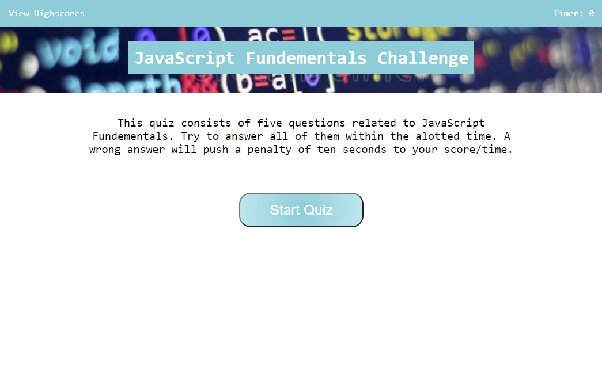
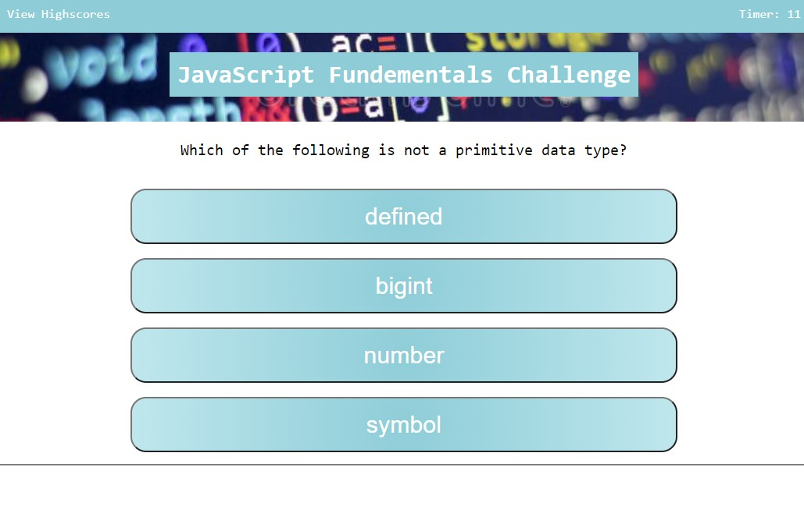
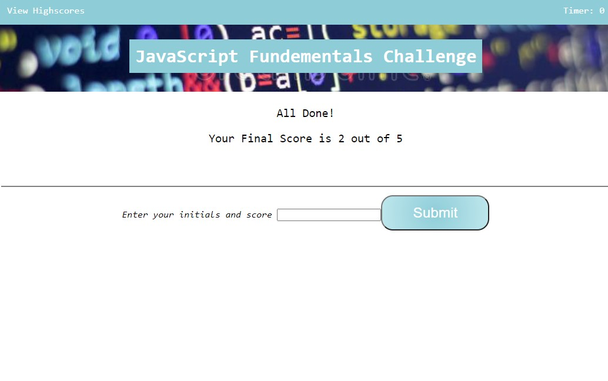
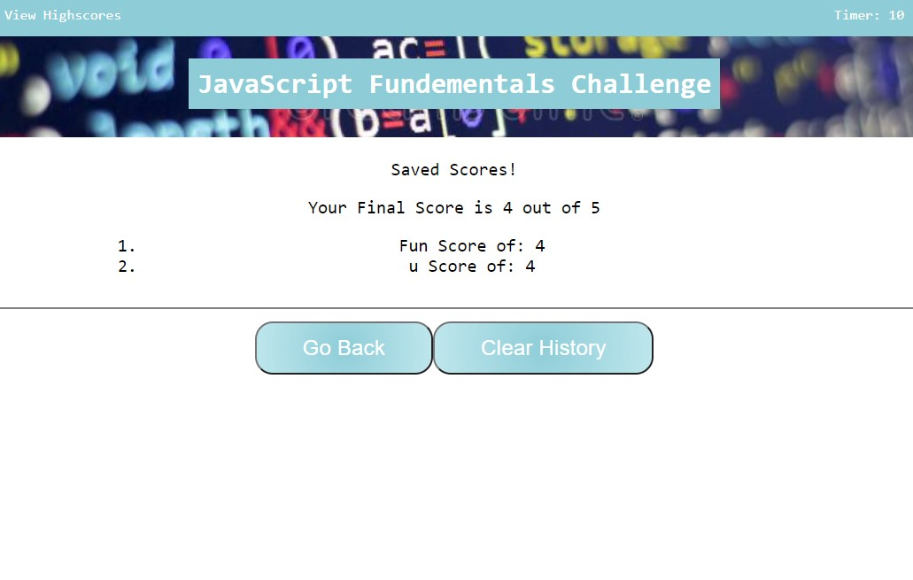

# JS_Fundementals_Quiz

## Description

- This is my second JavaScript homework assignment for the Full Stack Web Development bootcamp.
- The homework assignment goal was to generate a one page timed quiz game with multiple questions. At the end of the game. the user can save his/her score. 
- In completing this assignment I was able to apply the lessons from week four: Use of DOM API nodes to append, remove, and modify elements. 
- In order to fullfil the requirements of the assigment, I also considerably relied on even listners such as "click" on buttons and text.

The following is a descktop screenshot of the final version of the webpage when it was first submitted for review:

## Credits

For this homework assignment, I applied what was taught in the fourth week of class and used the following webpage as a significant resource.

- [JavaScript Client Side web API, Manipulation](https://developer.mozilla.org/en-US/docs/Learn/JavaScript/Client-side_web_APIs/Manipulating_documents)

## License

MIT License

Copyright (c) [2022] [Cristobal Marquez-Glynn]

Permission is hereby granted, free of charge, to any person obtaining a copy
of this software and associated documentation files (the "Software"), to deal
in the Software without restriction, including without limitation the rights
to use, copy, modify, merge, publish, distribute, sublicense, and/or sell
copies of the Software, and to permit persons to whom the Software is
furnished to do so, subject to the following conditions:

The above copyright notice and this permission notice shall be included in all
copies or substantial portions of the Software.

THE SOFTWARE IS PROVIDED "AS IS", WITHOUT WARRANTY OF ANY KIND, EXPRESS OR
IMPLIED, INCLUDING BUT NOT LIMITED TO THE WARRANTIES OF MERCHANTABILITY,
FITNESS FOR A PARTICULAR PURPOSE AND NONINFRINGEMENT. IN NO EVENT SHALL THE
AUTHORS OR COPYRIGHT HOLDERS BE LIABLE FOR ANY CLAIM, DAMAGES OR OTHER
LIABILITY, WHETHER IN AN ACTION OF CONTRACT, TORT OR OTHERWISE, ARISING FROM,
OUT OF OR IN CONNECTION WITH THE SOFTWARE OR THE USE OR OTHER DEALINGS IN THE
SOFTWARE.

## Badges

Coming Soon

## How to Contribute

Please feel free to review my code at [GITHUB](https://github.com/CM-GDev/JS_Fundementals_Quiz) for this project and provide feedback on how to improve code.

Here is the live webpage [link](https://cm-gdev.github.io/JS_Fundementals_Quiz/) to the latest version. 